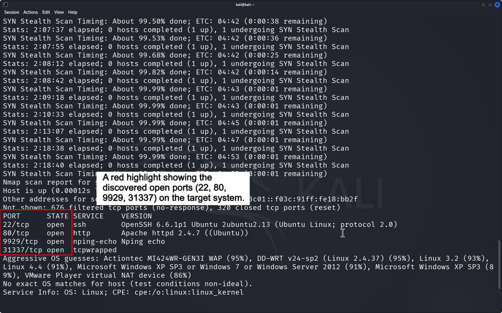
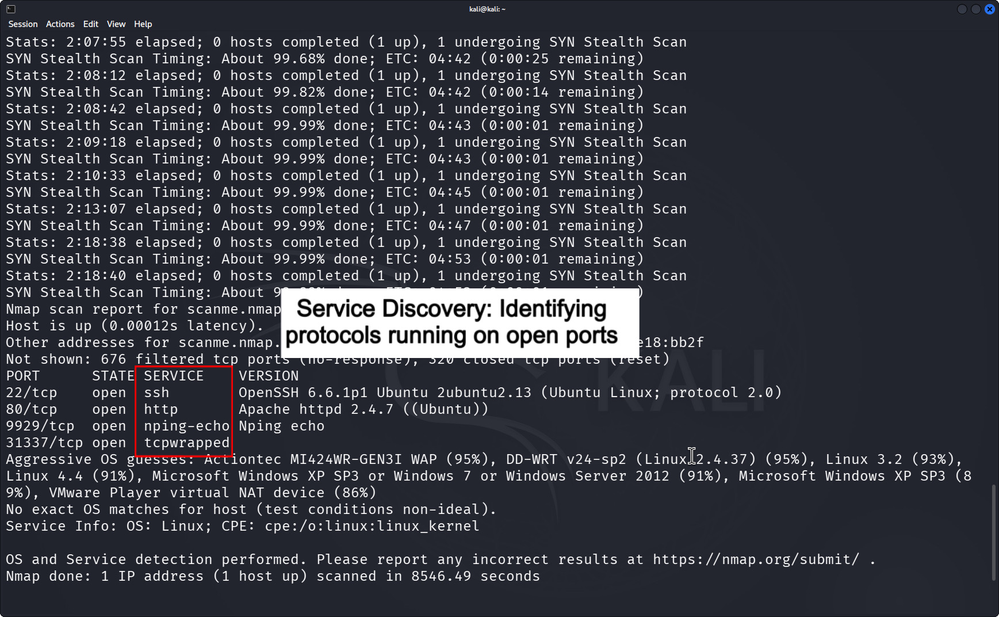
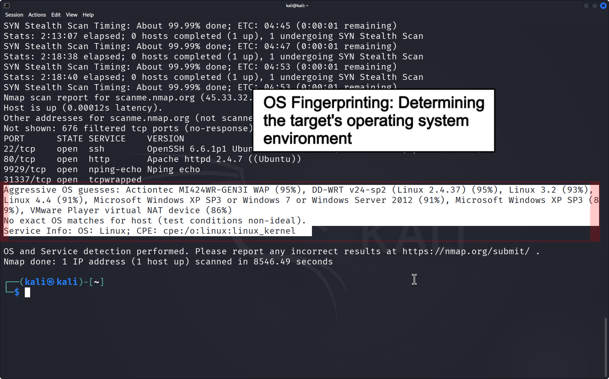
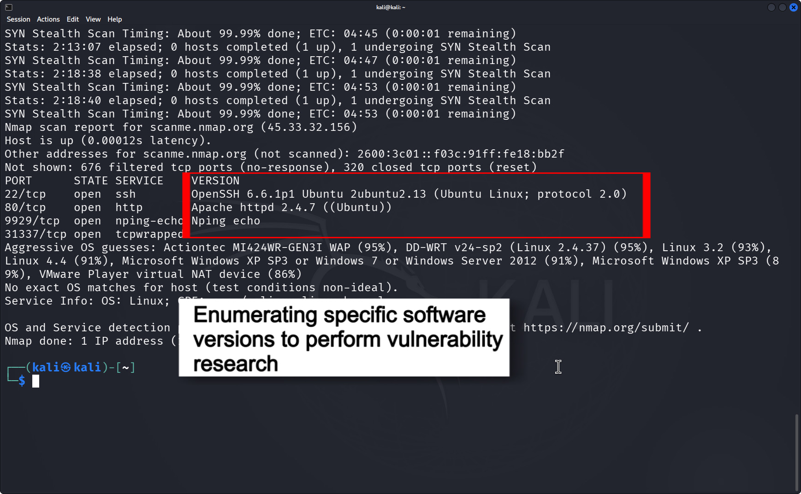

 ## Network Scanning & Vulnerability Analysis Lab

  

## Project Description

A comprehensive security assessment of `scanme.nmap.org` using industry-standard tools to identify open services and potential security risks.

## Technical Evidence Gallery

| 1. Port Identification | 2. Service Discovery |
|---|---|
|  |  |

| 3. OS Fingerprinting | 4. Version Analysis |
|---|---|
|  |  |

## Project Structure

- [Analysis Report](report/analysis_report.md)
- [Defensive Plan](report/defensive_plan.md)
- [Evidence](screenshots/)
- [Scan Results](scan-results/scan_report.md)
---
*Developed as part of Cybersecurity Professional Training.*
