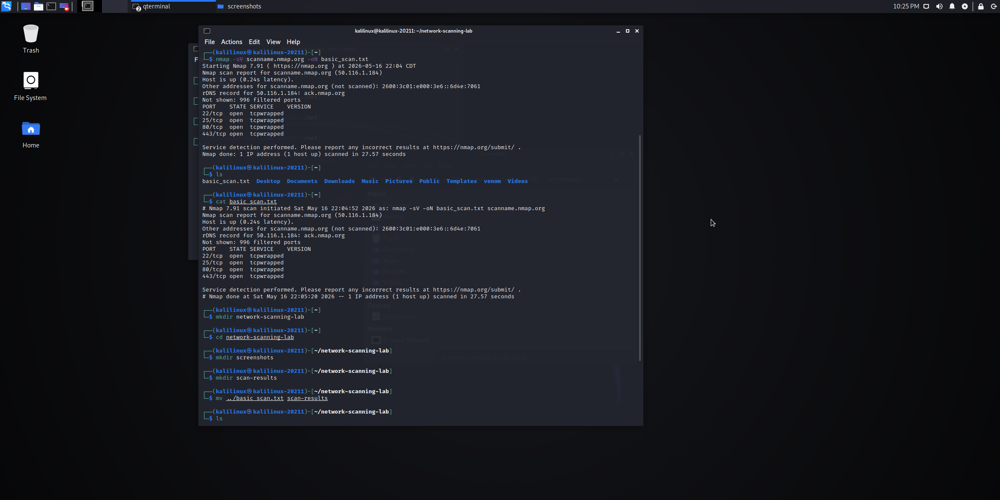

# Vulnerability Analysis Report -Network Scanning Lab 

## 1.Executive Summary
The goal of this assessment was to identify open ports, active service, and protocol vlunerabilities
on the target host `scanme.nmap.org`. 
The scan revealed serveral open services, some of which are running outdated versions that may pose a security risk.

## 2. Target Information
- **Target"** scanme.nmap.org 
- **IP Address:** 45.33.32.156
- **Scan Date:** may 17,2026

## 3. Methodology 
A service Version Detection scan (`-sV`) was performed using **nmap** to identify the software versions 
running on the detected ports 
### Scan Evidence

## 4. Techincal Findings & Analysis 

 
### Finding1: Outdated SSH Version
- **port:** 22/tcp
- **service:** SSH 
- **severity:** Medium 
- **Analysis:** OpenSSH 7.4 is an older version.
while not critical in all configurations, older versions often have know CVEs (common Vulnerabilities and Exposures)
such as potential user enumeration or denial of service risks.

### Finding2 : Outdated Web Server (Apache)
- **port:** 80/tcp
- **service:** HTTP
- **version:** Apache httpd 2.4.6 (CentOS)
- **Analysis:** This version of Apache is outdated.
it is recommended to hide the version header to prevent "Banner Grabbing" by attackers.

## Vulnerability Research (CVEs)

### [CVE-2016-10708] - OpenSSH Denial of Service

- **Applicability:** Potential risk for OpenSSH 7.4.

- **Details:** A flaw in the SSH protocol implementation could allow a remote attacker to cause a denial of service (NULL pointer dereference).

- **Reference:** [NVD - CVE-2016-10708](https://nvd.nist.gov/vuln/detail/CVE-2016-10708)

### [CVE-2017-15715] - Apache HTTP Server Arbitrary File Upload

- **Applicability:** Affects certain configurations of Apache 2.4.x.

- **Details:** A specially crafted request could bypass certain access restrictions.

- **Reference:** [NVD - CVE-2017-15715](https://nvd.nist.gov/vuln/detail/CVE-2017-15715)

## 5. Recommendaitons (Remediation)
1. **patching:** Update OpenSSH and Apache to the latest stable versions.
2. **Hardening:** Disable service banners to hide version information form unauthorized scans.
3. **Monitoring:** implement a firewall (WAF) to fillter incoming tarffic on port 80.

---
*Report generated by: Shrouq Al-Mejireshi* 
